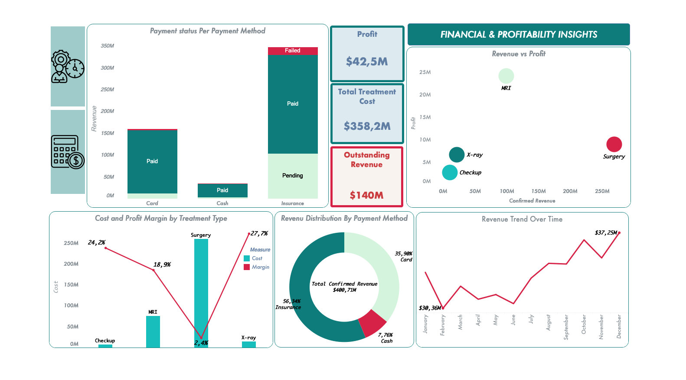
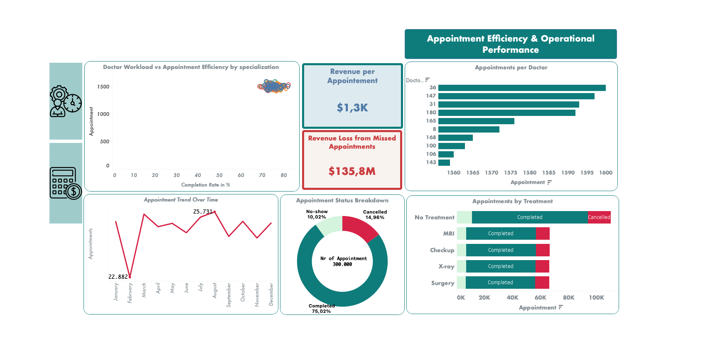

# 🏥 MediCore Health Systems — Healthcare Analytics  
### Financial & Operational Performance | Tableau

---

## 🌐 Overview

**MediCore Health Systems** is a fictional healthcare provider offering a range of medical services, including:

- 🩺 Checkups  
- 🧠 MRI (Magnetic Resonance Imaging)  
- 🦴 X-ray diagnostics  
- 🔬 Surgical procedures  

The organization manages both **financial performance** and **appointment operations** across its departments.

This project combines two dashboards to deliver a **complete view of revenue, profitability, and operational efficiency**.

---

## 🎯 Objective

This analysis aims to:

- Improve **revenue collection and cash flow**  
- Optimize **treatment profitability**  
- Reduce **missed appointments and revenue loss**  
- Enhance **operational efficiency and resource allocation**  

---

## ⚠️ Problem Statement

MediCore faces challenges in managing financial and operational performance due to the lack of a unified data-driven approach.

### Key Issues:
- Difficulty tracking **profitability across treatments**  
- Delayed and **outstanding payments**  
- High number of **missed appointments**  
- Inefficient **scheduling and workload management**  

### Impact:
- **~$140M outstanding revenue** affecting cash flow  
- **~$135.8M revenue loss** from missed appointments  
- Dependency on **slow insurance payments**  
- Inefficient use of **resources and scheduling systems**  

---

# 📊 Dashboard 1 — Financial & Profitability Analysis

## 🔍 Key Insights

### 💰 Financial Performance & Cash Flow
- Total treatment cost: **$358.2M**  
- Total profit: **$42.5M**  
- Outstanding revenue: **$140M**  

👉 **Insight:**  
Strong revenue performance is limited by **cash flow inefficiencies caused by delayed payments**.

---

### 💳 Payment Method Dependency
- Insurance: **56% of revenue**  
- Card: **35.9%**  
- Cash: **7.76%**  

👉 **Insight:**  
Heavy reliance on insurance leads to **slower revenue realization and increased pending payments**.

---

### 📈 Profitability by Treatment
- Surgery → highest revenue  
- MRI → highest profit  
- X-ray → highest margin (~27.7%)  

👉 **Insight:**  
High revenue does not always translate into high profitability, revealing **pricing and cost optimization opportunities**.

---

### 📉 Revenue Trend
- Revenue shows overall growth with fluctuations  

👉 **Insight:**  
Growth is positive but **inconsistent**, indicating possible seasonal or operational effects.

---

# 📊 Dashboard 2 — Appointment Efficiency & Operational Performance

## 🔍 Key Insights

### 1. 💰 Revenue per Appointment
- Average revenue per appointment: **$1.3K**

👉 **Insight:**  
Each appointment generates strong value, meaning missed or inefficient appointments have a significant financial impact.

---

### 2. ❌ Revenue Loss from Missed Appointments
- Total loss: **$135.8M**

👉 **Insight:**  
Missed appointments represent a major revenue leakage and highlight inefficiencies in scheduling and patient management.

---

### 3. 👨‍⚕️ Appointments per Doctor
- Some doctors handle slightly more appointments than others  
- Overall distribution remains relatively balanced  

👉 **Insight:**  
Workload is fairly well distributed, but small differences may affect efficiency and waiting times.

---

### 4. 📊 Doctor Workload vs Efficiency (Scatter Plot)
- Completion rates are consistent (around **70–80%**)  
- Appointment volume is similar across specializations  

👉 **Insight:**  
The system is balanced, but even small improvements in completion rates can significantly increase total completed appointments and revenue.

---

### 5. 📈 Appointment Trend Over Time
- Monthly appointments range from **~22K to ~25K**  
- Fluctuations across months  

👉 **Insight:**  
Demand is not stable, requiring better forecasting and adaptive scheduling.

---

### 6. 🔄 Appointment Status Breakdown
- Completed: **~75%**  
- Cancelled and no-show: **~25% combined**  

👉 **Insight:**  
There is no extreme imbalance, but the gap is still large enough to impact efficiency and revenue.

---

### 7. 🧪 Appointments by Treatment
- Some treatments have higher cancellation proportions  
- A noticeable portion of appointments results in **no treatment**

👉 **Insight:**  
Not all appointments convert into treatments, which reduces operational efficiency and resource utilization. Improving conversion from appointment to treatment is a key opportunity.

---

# 🎯 Summary Insight

Even though the system appears **balanced and stable**, inefficiencies come from:

- Missed appointments  
- Partial conversion (appointments → treatments)  
- Small gaps in completion rates  

👉 These small inefficiencies, when scaled, lead to **significant revenue loss and operational impact**.

---

# 💡 Business Recommendations

- Improve **payment collection processes** to reduce outstanding revenue  
- Reduce missed appointments using **reminders and scheduling optimization**  
- Focus on **high-margin treatments** to improve profitability  
- Optimize **pricing strategies across services**  
- Maintain balanced workloads while improving **completion rates**  
- Use demand patterns to improve **staffing and resource planning**  

---

# 🚀 Business Impact

This analysis enables MediCore Health Systems to:

- Improve **cash flow and revenue collection**  
- Increase **profitability across treatments**  
- Reduce **operational inefficiencies**  
- Enhance **appointment scheduling and resource allocation**  
- Support **data-driven decision-making across departments**  

---

# 🧠 Key Takeaway

Combining financial and operational analytics shows that:

👉 Improving **payment efficiency**,  
👉 Reducing **missed appointments**, and  
👉 Optimizing **treatment performance**  

are critical to maximizing both **profitability** and **operational efficiency** in healthcare systems.
