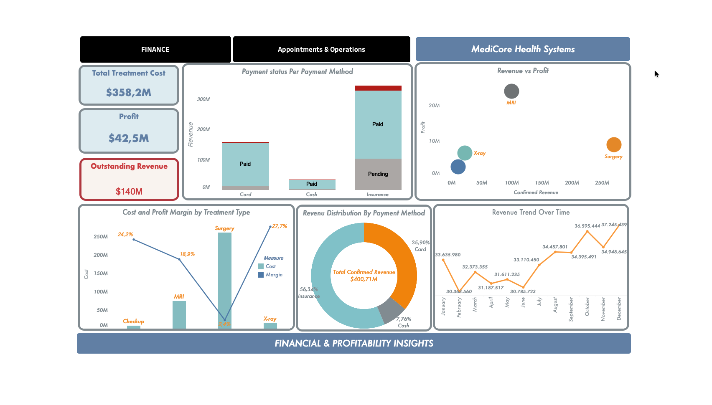
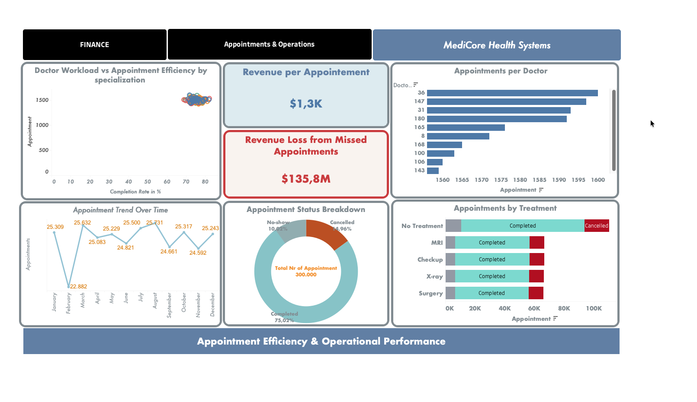

# MediCore Health Systems — Healthcare Analytics (Financial & Operational) | Tableau

---

## Overview

MediCore Health Systems is a fictional healthcare provider offering a range of medical services, including:

- **Checkups**
- **MRI (Magnetic Resonance Imaging)**
- **X-ray diagnostics**
- **Surgical procedures**

The hospital manages both **financial performance** and **patient appointment operations** across its departments. This project combines two dashboards to provide a complete view of business performance and operational efficiency.

---

## Objective

To analyze healthcare data and identify opportunities to:

- Improve revenue collection and cash flow  
- Optimize treatment profitability  
- Reduce missed appointments  
- Enhance operational efficiency and resource allocation

## Problem Statement

MediCore Health Systems faces challenges in managing both financial performance and operational efficiency. The hospital lacks a unified, data-driven approach to:

- Track profitability across different treatments  
- Manage delayed and outstanding payments  
- Reduce missed appointments and revenue loss  
- Optimize doctor workload and scheduling efficiency  

This results in:
- Significant **outstanding revenue (~$140M)** affecting cash flow  
- High **revenue loss (~$135.8M)** from missed appointments  
- Dependency on slower payment methods such as insurance  
- Inefficiencies in appointment scheduling and resource utilization  

---

# Dashboard 1: Financial & Profitability Analysis

## Key Insights

### 1. Financial Performance & Cash Flow
- Total treatment cost: **$358.2M**  
- Total profit: **$42.5M**  
- Outstanding revenue: **$140M**  

👉 **Insight:**  
Strong revenue generation is impacted by **delayed payments and cash flow inefficiencies**.

---

### 2. Payment Method Dependency
- Insurance: **56 percent of revenue**  
- Card: **35.9 percent**  
- Cash: **7.76 percent**  

👉 **Insight:**  
Heavy reliance on insurance leads to **slower revenue realization and higher pending payments**.

---

### 3. Profitability by Treatment
- Surgery: highest revenue  
- MRI: highest profit  
- X-ray: highest margin (~27.7 percent)  

👉 **Insight:**  
High revenue does not always mean high profitability, highlighting **pricing and cost optimization opportunities**.

---

### 4. Revenue Trend
- Revenue increases over time with some fluctuations  

👉 **Insight:**  
Growth is positive but **not consistent**, suggesting seasonal or operational factors.

---

# Dashboard 2: Appointment Efficiency & Operations

## Key Insights

### 1. Revenue Loss from Missed Appointments
- Revenue loss: **$135.8M**  

👉 **Insight:**  
Missed appointments create a **significant financial and operational loss**.

---

### 2. Appointment Completion Rate
- Completed: **75 percent**  
- Remaining: cancellations and no-shows  

👉 **Insight:**  
A large portion of appointments is not completed, reducing efficiency and revenue.

---

### 3. Doctor Workload & Specialization
- Workload is **evenly distributed across specializations**  
- Completion rates are consistent (70–80 percent)  

👉 **Insight:**  
The system is balanced, but **small improvements in completion rates can increase total completed appointments and revenue**.

---

### 4. Appointment Trends
- Monthly volume: **~22K to ~25K appointments**  

👉 **Insight:**  
Demand fluctuates, requiring **better forecasting and scheduling optimization**.

---

### 5. Treatment & Appointment Patterns
- Some treatments show higher cancellation rates  

👉 **Insight:**  
Certain services are more prone to cancellations, affecting operational performance.

---

# Business Recommendations

- Improve **payment collection processes** to reduce outstanding revenue  
- Reduce missed appointments through **reminders and scheduling optimization**  
- Focus on **high-margin treatments** to improve profitability  
- Optimize **pricing strategies across services**  
- Maintain balanced workloads while improving **completion rates**  
- Use demand trends to improve **staffing and resource planning**  

---

# Business Impact

This project enables MediCore Health Systems to:

- Improve **cash flow and revenue collection**  
- Increase **profitability across treatments**  
- Reduce **operational inefficiencies**  
- Enhance **appointment scheduling and resource allocation**  
- Support **data-driven decision-making**  

---

# Key Takeaway

Combining financial and operational analytics shows that improving payment efficiency, reducing missed appointments, and optimizing treatment performance are key to maximizing profitability and operational efficiency in healthcare systems.
